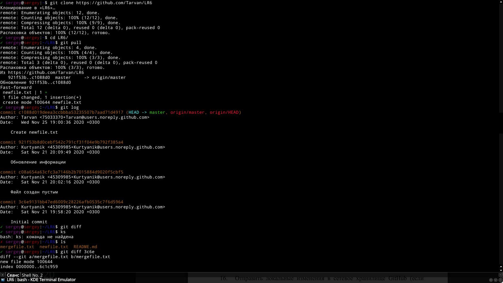
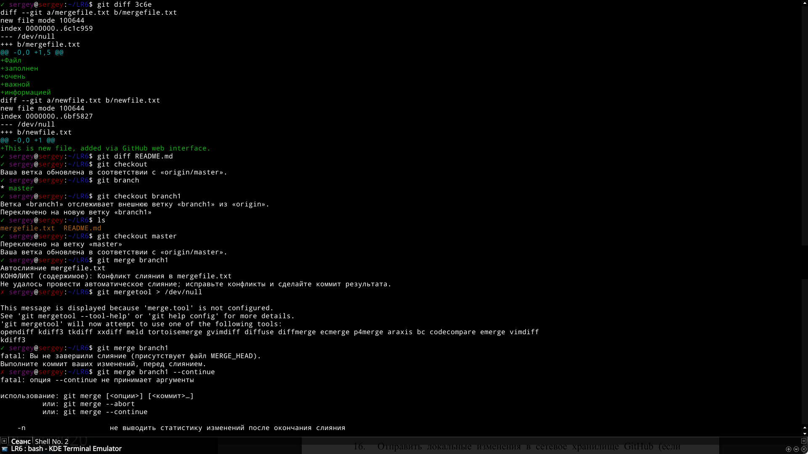

# Отчёт
## Цель работы
изучение  базовых  возможностей  системы управления версиями, опыт работы с Git Api, опыт работы с локальным и удаленным репозиторием.

## Лог команд
	git config --global -e
	git clone https://github.com/Tarvan/LR6
	cd LR6/
	git pull
	git log
	git diff 3c6e
	git mergetool > /dev/null
	git merge branch1
	rm mergefile.txt.orig
	git branch -d branch1
	vi helloWorld.c
	git add helloWorld.c
	git commit
	vi helloWorld.c++
	git add helloWorld.c++
	git commit
	vi README.md
	git add README.md
	git commit
	git revert HEAD

## Скриншоты

## Вывод
Получены базовые навыки работы с системой контроля версий Git и хостингом исходного кода GitHub.

## История операций
	commit 24e47b95b48c524da06e03b77535d09fa2714ea4
	Author: Sergej Abramov 4916 <name.incognito123789@yandex.ru>
	Date:   Wed Nov 25 22:04:56 2020 +0300
	
	    Report written.
	
	commit 622a969b5a53331e9087b64bbfb537427e7259b9
	Author: Sergej Abramov 4916 <name.incognito123789@yandex.ru>
	Date:   Wed Nov 25 21:02:02 2020 +0300
	
	    Console screenshots added.
	
	commit 066d18b78dd6a7bbeedca24844f3e144f1082da4
	Author: Sergej Abramov 4916 <name.incognito123789@yandex.ru>
	Date:   Wed Nov 25 20:51:31 2020 +0300
	
	    Revert "Bad commit."
	    
	    This reverts commit 83d4f92772d7bafd1ed83481e14beb0b482e197a.
	
	commit 83d4f92772d7bafd1ed83481e14beb0b482e197a
	Author: Sergej Abramov 4916 <name.incognito123789@yandex.ru>
	Date:   Wed Nov 25 19:36:36 2020 +0300
	
	    Bad commit.
	
	commit 451a03dd09137b860ca44993a52bf695c41054f6
	Author: Sergej Abramov 4916 <name.incognito123789@yandex.ru>
	Date:   Wed Nov 25 19:30:45 2020 +0300
	
	    Added Hello world program in C++ (helloWorld.c++ file).
	
	commit 0d8827783a334198ab5f99ca08d89210016c38ff
	Author: Sergej Abramov 4916 <name.incognito123789@yandex.ru>
	Date:   Wed Nov 25 19:28:32 2020 +0300
	
	    Added HelloWorld program in C (helloWorld.c file).
	
	commit f7df5cac7c5ea69dd394edcded12d73f846080cf
	Merge: c1088d0 0f9f50d
	Author: Sergej Abramov 4916 <name.incognito123789@yandex.ru>
	Date:   Wed Nov 25 19:23:58 2020 +0300
	
	    Merge branch 'branch1'
	
	commit c1088d019deea3ccbbba53235507b7aad71d4917
	Author: Tarvan <75033370+Tarvan@users.noreply.github.com>
	Date:   Wed Nov 25 19:00:36 2020 +0300
	
	    Create newfile.txt
	
	commit 921f53b8d0cebf542c791cf31f04e9b792f385a4
	Author: Kurtyanik <45309985+Kurtyanik@users.noreply.github.com>
	Date:   Sat Nov 21 20:09:49 2020 +0300
	
	    Обновление информации
	
	commit 0f9f50db68a6983b47398017545532cd0f992846
	Author: Kurtyanik <45309985+Kurtyanik@users.noreply.github.com>
	Date:   Sat Nov 21 20:08:33 2020 +0300
	
	    Заполнил файл
	
	commit c08a654a63cfc3a7146b2b7015884d9020f5cbf5
	Author: Kurtyanik <45309985+Kurtyanik@users.noreply.github.com>
	Date:   Sat Nov 21 20:02:16 2020 +0300
	
	    Файл создан пустым
	
	commit 3c6e9131bb47ed6009c28226afb0535c7f6d5964
	Author: Kurtyanik <45309985+Kurtyanik@users.noreply.github.com>
	Date:   Sat Nov 21 19:58:20 2020 +0300
	
	    Initial commit
