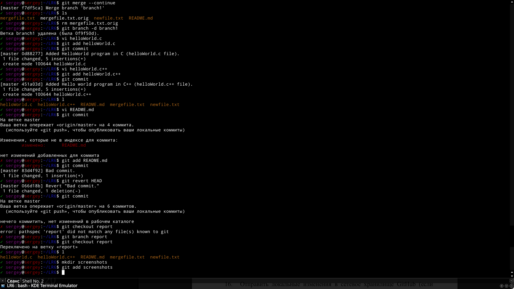

# Отчёт
## Цель работы
изучение  базовых  возможностей  системы управления версиями, опыт работы с Git Api, опыт работы с локальным и удаленным репозиторием.

## Лог команд
	git config --global -e
	git clone https://github.com/Tarvan/LR6
	cd LR6/
	git pull
	git log
	git diff 3c6e
	git mergetool > /dev/null
	git merge branch1
	rm mergefile.txt.orig
	git branch -d branch1
	vi helloWorld.c
	git add helloWorld.c
	git commit
	vi helloWorld.c++
	git add helloWorld.c++
	git commit
	vi README.md
	git add README.md
	git commit
	git revert HEAD

## Скриншоты

## Вывод
Получены базовые навыки работы с системой контроля версий Git и хостингом исходного кода GitHub.
